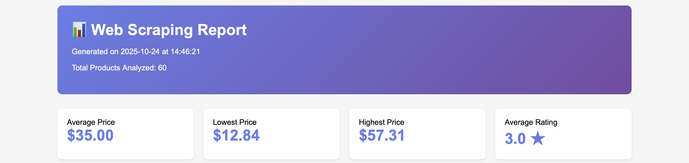
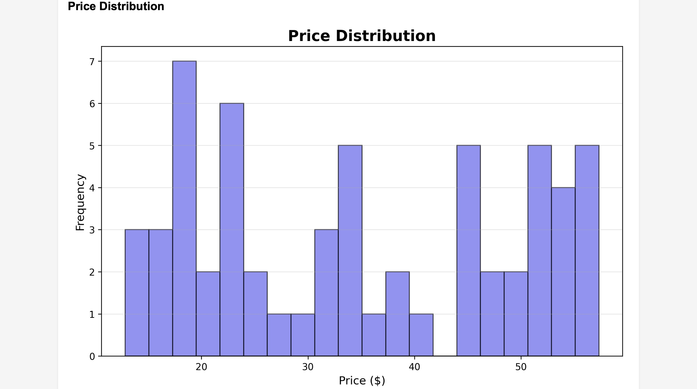
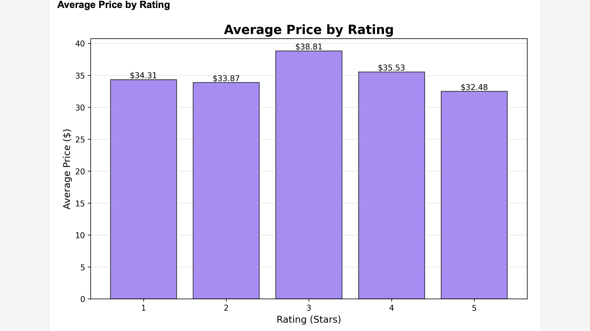
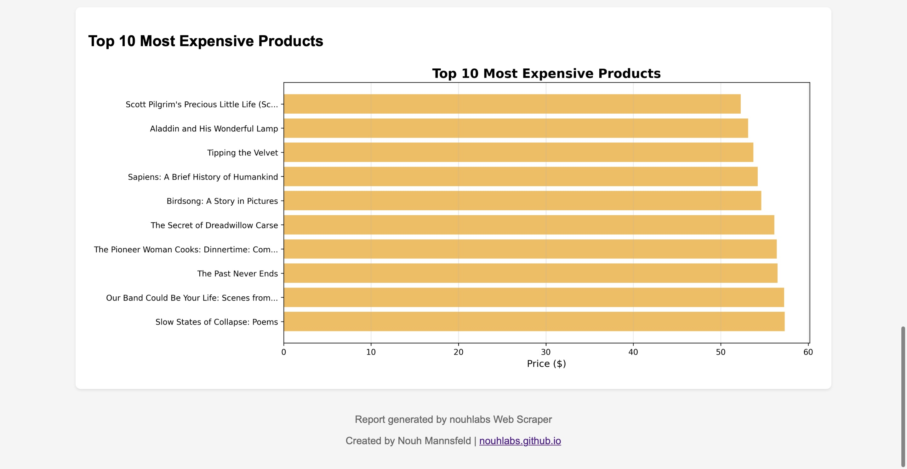

# Professional Web Scraper with Data Visualization

A Python-based web scraping tool that collects product data from e-commerce websites, performs statistical analysis, and generates beautiful visual reports with charts and graphs.

## 🚀 Features

- **Automated Web Scraping** - Collects product data from multiple pages automatically
- **Statistical Analysis** - Calculates averages, medians, price ranges, and rating distributions  
- **Data Visualization** - Generates professional charts (histograms, bar graphs)
- **Multiple Export Formats** - CSV for Excel/Google Sheets, HTML for presentations
- **Clean Code Structure** - Object-oriented Python with comprehensive error handling
- **Professional Reports** - Beautiful HTML reports with embedded visualizations

## 📊 Sample Output

### Statistics Generated:
- Average Price: $35.00
- Median Price: $35.35
- Lowest Price: $12.84
- Highest Price: $57.31
- Average Rating: 3.0 stars

### Visualizations:

**Price Distribution**

**Average Price by Rating**

**Top 10 Most Expensive Products**

## 🛠️ Technologies Used

- **Python 3.12+** - Core programming language
- **BeautifulSoup4** - HTML parsing and web scraping
- **Requests** - HTTP library for web requests
- **Pandas** - Data manipulation and analysis
- **Matplotlib** - Statistical data visualization

## 📦 Installation

